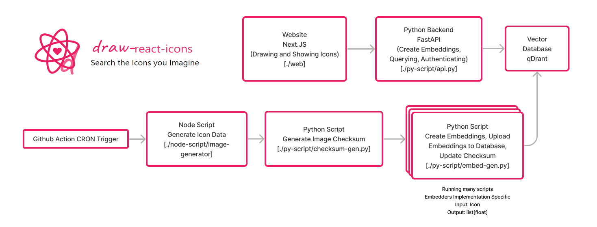

# [Draw React Icons](https://draw-react-icons.kaenova.my.id)

Welcome to the Draw React Icons repository! We're trying to make your icon searching experience much better by utilizing machine learning and vector database. 

## Architecture

## Supported By

- [Github Action](https://github.com/features/actions): Providing Free Tier Github Action to update the icon embeddings to database.
- [Vercel](https://vercel.com/): Providing Hobby Tier to host our frontend website.
- [Qdrant](https://qdrant.tech/): Providing lightweight, high performance vector database
- [IDCloudhost](https://idcloudhost.com/en/): Cheap virtual machine hosting
